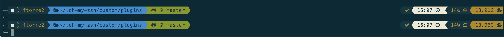

# oh-my-zsh-mac

1) install zsh and oh my zsh

```
xcode-select --install
ruby -e "$(curl -fsSL https://raw.githubusercontent.com/Homebrew/install/master/install)"
brew install zsh
sh -c "$(curl -fsSL https://raw.githubusercontent.com/robbyrussell/oh-my-zsh/master/tools/install.sh)"
```

2) install themes

Download the zip file from here (https://github.com/mbadolato/iTerm2-Color-Schemes) and import all the files in iTerm2 (See below in the bottom right corner) under schemes folder in the zip file.

AKA: git clone this repo, go to iterm and import all from schema folder

3) Install fonts from here: https://github.com/ryanoasis/nerd-fonts/tree/master/patched-fonts/Meslo/L/Regular/complete

4) installing plugins

```
cd $ZSH_CUSTOM/plugins

git clone https://github.com/zsh-users/zsh-autosuggestions ${ZSH_CUSTOM:-~/.oh-my-zsh/custom}/plugins/zsh-autosuggestions
git clone https://github.com/zsh-users/zsh-syntax-highlighting.git
```

Result:


